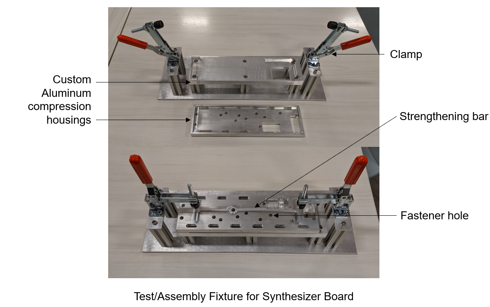
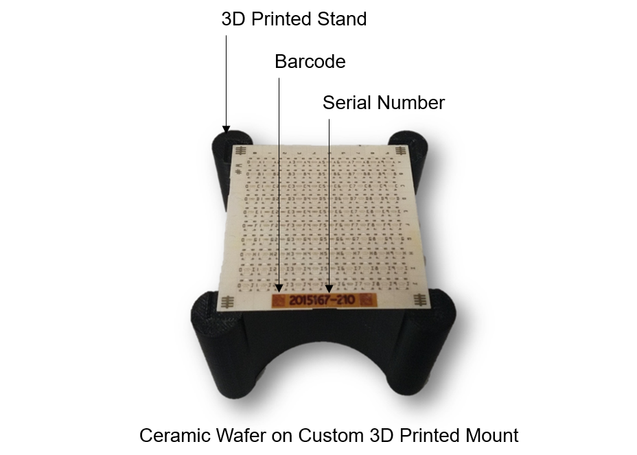
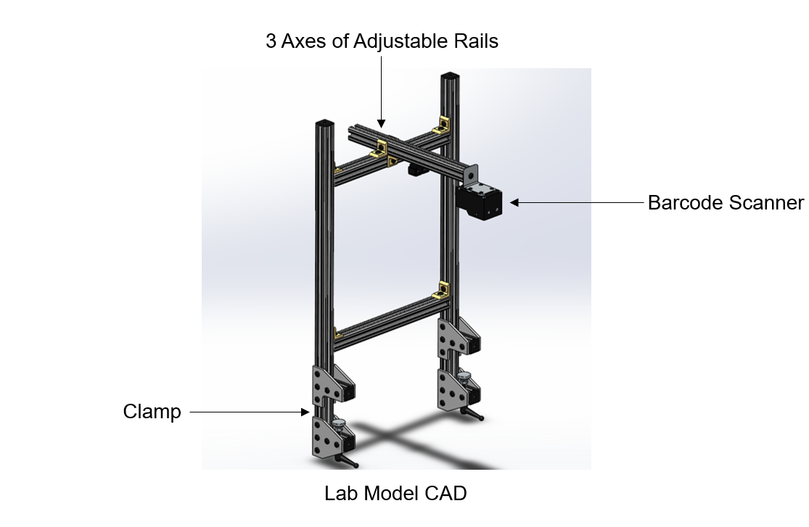
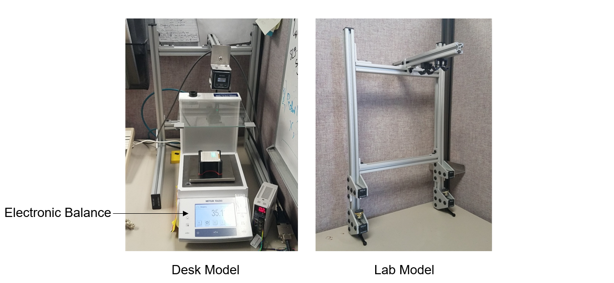
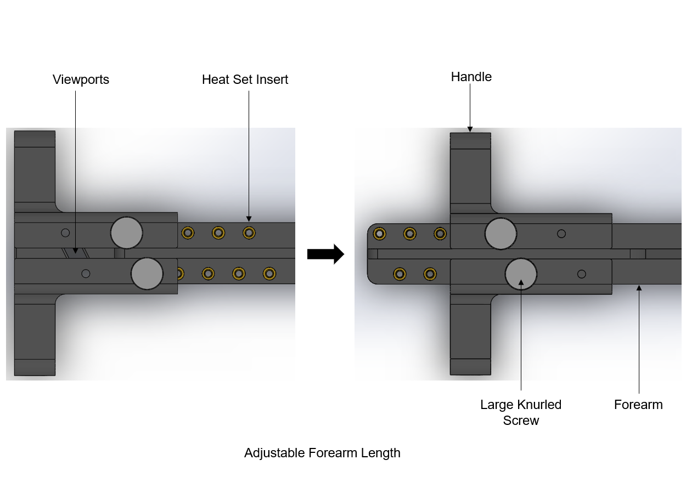

## Navagation
- [Professional Summary](#professional-summary)
- [CO-OP EXPERIENCES](#co-op-experiences)
  - [Starry Inc.](#starry-inc)
  - [Siemens Healthineers](#siemens-healthineers)
  - [Hasbro](#hasbro)
- [Capstone](#capstone)
- [Personal Projects](#personal-projects)

## Professional Summary

I am a Mechanical Engineer with a bachelors degree from Northeastern University in Boston, Massachusetts. I graduated Magna Cum Laude as a member of the Pi Tau Sigma Honor Society. Outside of class I was involved in other organizations including Northeastern’s American Society of Mechanical Engineers chapter and NU Toys, an engineering club that uses toys to facilitate engineering design and projects.

I have completed three full-time co-ops to diversify and refine my engineering skills outside of university. My first position was as a mechanical engineer at Siemens Healthineers in Walpole, MA, where I worked on machinery and lab equipment in a medical environment. For my second co-op, I was an animatronics engineer at Hasbro Inc. in Pawtucket, RI, where I utilized mechanics, electronics, and programming to create robotic toys. My last co-op was at Starry Inc., a wireless internet startup based in Boston. There I led the effort to create a neighborhood-level antenna enclosure, learned to design for manufacturing, developed test fixtures, and worked with domestic and international vendors. Finally, my capstone team developed a haptically linked robotic arm and exoskeleton to allow users to transmit their motion as a part of Northeastern University’s Avatar XPRIZE Challenge effort.

Now, I am searching for a full-time position in the Greater Boston Area. I am interested in product design, manufacturing, robotics, vehicles, and more!

# **CO-OP EXPERIENCES**
## **Starry Inc.**
### Concealed Antenna Enclosure
**Objectives**
 
- Use existing urban antennae in a suburban environment
- Conceal the antennae to comply with town approved specifications
- Make the enclosure environment-proof and have adequate air flow
- Mount the enclosure on top of existing utility poles
 

**Challenges**
 
- Current Point antennae are large and awkwardly shaped to fit in a cylinder, the desired form of the enclosure
- Enclosure must be sturdy enough for  high wind speeds, rain, and snow, and also be formed so that the wall in front of the antennae     is RF transparent
- Utility poles have varying diameters and tilts that need to be accounted for in the mount
- The overall design must be relatively simple to assemble and light enough for one technician to install
 

  

 

**Design**
 
- Designed multiple possible mounts before settling on the final form
- Created custom steel and aluminum frame to hold up to 4 antenna modules, with multiple mounting holes to allow ±10° tilt and adjustable pole top mount for any diameter pole
- Collaborated with Chinese manufacturer to refine an injection molded shroud that has a specific thickness for RF transparency
- Included vents in the enclosure cap for airflow
- Maximized cutouts in metal frame to reduce weight for ease of installation
- Assembled design in-house and confirmed feasibility of one-man assembly
 

  
  

 

**Test Fixtures**
 
- Designed and built multiple test fixtures to facilitate testing and assembly of RF products
- Utilized clamps for compression to ensure fastener depth
- Included precise holes for fasteners and test wiring
- Used off-the-shelf components where possible and custom machined steel and aluminum where necessary
 

  

 

## **Siemens Healthineers**
### Ceramic Wafer Scanner
**Problem**
 

- Lab technicians had to manually enter serial numbers on ceramic wafers after weighing them
- Serial numbers were often entered incorrectly, requiring a system reset
- The process of weighing and then typing slowed down production
- System resets could take hours to resolve when engineers were not available

 

  

 

**Action**
 

- I designed a lab fixture that holds a barcode scanner with vertical and horizontal adjustability so that it can accommodate any future balance
- By talking to the technicians that would be using the fixture, I decided to position the scanner above the electronic balances that weigh the wafers so that they could be immediately scanned in place
- The first iteration I built was designed to sit on the desk of the engineer testing the barcode software (as opposed to the lab technicians)
- I designed the second iteration for the lab and chose to clamp it to the lab table to increase stability and minimize space use

 

  

 

**Results**
 

- The scanner eliminated all manual data entry, so no more system resets are needed
- I observed that eliminating typing and resets increased ceramic wafer processing by over 50%
- I reached out to the lab and they were pleased that it decreased errors and strain by combining weighing and scanning and eliminating typing
 

  

 

## **Hasbro**
### Animatronics

 
Due to NDA restrictions I can only share a limited amount of what I did, but here are a few key points summarizing my overall experience in this position.
 

**Objectives**
 

- The purpose of Hasbro’s Animatronics department is to create fun, interactive toys that push the boundaries of what a kid’s product can do
- I worked with popular name brands from Star Wars to Marvel to Disney Princesses 
- As a member of an eight person team responsible for hundreds of millions of dollars in revenue, I developed new ideas into working models and continued progress on projects already in motion
- The following slides will detail some of my competencies that I used on animatronic products and then an example of the type of product I worked on 

 

**Competencies**

 

- My mechanical background was helpful in creating over 50 unique parts in SolidWorks like gears and cams
- These virtual models translated into 3-D printing and laser cutting for rapid prototyping
- With physical materials, I had the opportunity to use power tools like a Dremel, drill press, and lathe, along with regular hand tools
- Electrical engineering quickly became important as I found myself soldering components onto circuits that performed tasks like syncing up four Furby robots and altering servo motors to spin continuously
- I used computer science while working with Arduino components and toy-industry specific chips that used a proprietary language that controls sounds, lights, and movements in production models
- I also used programs like Adobe Illustrator, Adobe Premiere, and Sound Forge for graphic design of packaging and audiovisuals for internal use

 

  

 

**Example**

 

- This is the FurReal Munchin’ Rex: it is a product I did finishing work on, but I will use it here as an example of the process I would use while developing other products that have yet to be released
- I would be given this toy idea to make based on trending interests; in this case, recently that has been dinosaurs
- I start by determining what movements and sensors to include in the first model, and create a prototype in SolidWorks that I can 3D print and tinker with
- Early models use servo motors to test motions, but eventually I would change over to one DC motor and use cams to translate that one motion into three 
- Cost reduction plays a big role in refining products because although I would like to include arm movements, a gyroscope, or more fur, certain features need to be eliminated to make the target cost
- Once I receive DC motor models from China, I would begin coding various movement and sound sequences and the sensors that trigger them
- After much back and forth with China, child-testing, and cost reducing, Rex will finally be manufactured and sold worldwide

 

  

 

# **Capstone**
## **Avatar XPRIZE Capstone**
 

**Objectives**
 

- Create a haptically linked robotic arm and exoskeleton system to transmit human motion remotely
- Design wearable exoskeleton with same degrees of freedom as robotic arm
 

  

 

**Results**

 

- Designed 3D printed exoskeleton with four degrees of freedom
- Three DoF in shoulder meet at one point to simulate ball and socket joint
- Integrated motors and encoders into housings to transmit position and receive haptic feedback for each DoF
- Demonstrated exoskeleton at final capstone presentation

 

  
  
  

 

# **Personal Projects**
## **3D Printed Mini Engine Model**  

 

**Goal**  

 

- My aim with this personal project is to independently design a 3D printed model of an engine that demonstrates the basics of the internal combustion engine
- I also want to improve my skills in SolidWorks by designing the entire system with no outside CAD
- The end product will move like a real engine but be driven by a DC motor 

 

  

 

**Progress and Future Steps**
 

- As of now, the engine block, crankshaft, piston, and connecting rod have been printed
- The timing belt will most likely be a rubber band connecting the crankshaft to the camshaft via pulleys
- A DC motor will connect to the crankshaft to drive the motion
- I would like to incorporate a Roots type supercharger, which would also be driven off the crankshaft
- Due to time and space constraints, I chose a single-cylinder engine, but I would like to scale up in the future with more pistons

 

  

 

# Contact Information 
 

[LinkedIn](www.linkedin.com/in/briantho)
 
Email: contact@briantho.com

# Thank you! 

